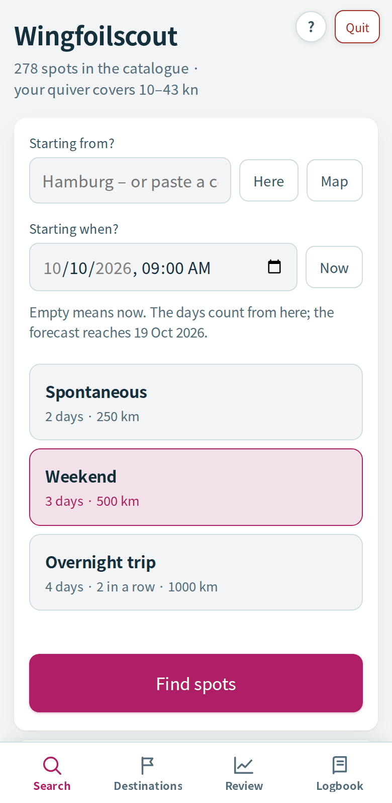
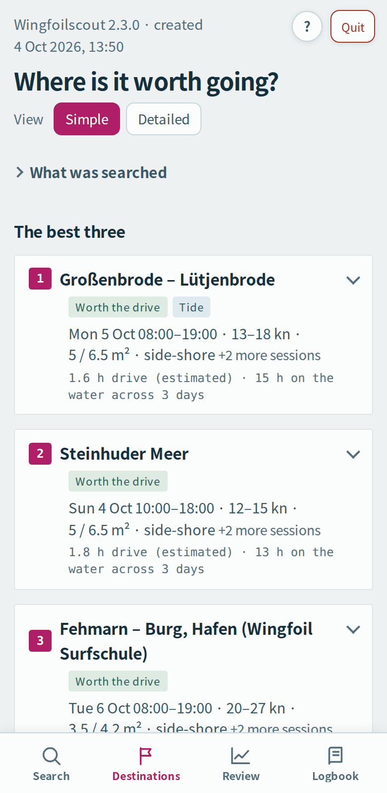
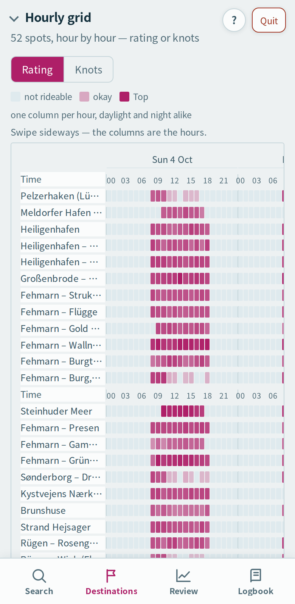

# Wingfoilscout

*Esta guía en: [English](README.md) · [Deutsch](README.de.md) · [Français](README.fr.md) · **Español***

Encuentra sesiones de wingfoil a tu alrededor y genera un informe HTML:
**dónde sopla el viento, cuándo, con qué wing — y si merece la pena el viaje.**

Combina tres modelos meteorológicos (más un ensemble para la fiabilidad) con
lo que sabe de 278 spots: sectores de viento, geometría de la costa de
OpenStreetMap, mareas, térmicas, tiempos de viaje. Funciona en local, en tu
propio ordenador, sin cuenta y sin paquetes de terceros salvo PyYAML. Todas
las velocidades del viento van en **nudos**. La interfaz habla inglés, alemán,
francés y español.

<p align="center">
<picture><source media="(prefers-color-scheme: dark)" srcset="docs/bilder/en/search-dark.png"></picture>
<picture><source media="(prefers-color-scheme: dark)" srcset="docs/bilder/en/destinations-dark.png"></picture>
<picture><source media="(prefers-color-scheme: dark)" srcset="docs/bilder/en/grid-dark.png"></picture>
</p>
<p align="center"><sub>Vista de ejemplo con datos meteorológicos inventados ·
<a href="https://darkpiratego.github.io/wingfoilscout/">Sitio web</a> ·
<a href="https://darkpiratego.github.io/wingfoilscout/demo.html">Informe de ejemplo</a></sub></p>

Hasta la versión 2.0, el proyecto se llamaba **Wingscout**; las entradas
antiguas del registro de cambios y los informes de revisión y de auditoría aún
llevan ese nombre. Internamente, el paquete de Python se sigue llamando
`wingscout` — por eso los comandos de abajo tienen ese aspecto.

La versión actual está en `wingscout/__init__.py`, bajo el logo a la derecha de la barra de pestañas en cada página y en el pie de cada informe · cómo decide Wingfoilscout: [`SCORING.md`](SCORING.md) · cambios en [`CHANGELOG.md`](CHANGELOG.md) (las entradas antiguas, en alemán) · hallazgos abiertos en [`REVIEW.md`](REVIEW.md) (en alemán, histórico) · licencia: [PolyForm Noncommercial 1.0.0](LICENSE) (© 2026 DARK)

---

## Instalación

### En Mac, con Terminal (recomendado)

Dos líneas para pegar en el **Terminal** — está en Aplicaciones →
Utilidades, o escribe «Terminal» en Spotlight:

1. **Una vez por Mac: las herramientas de línea de comandos de Apple.**
   Traen Python y `git`:

   ```bash
   xcode-select --install
   ```

   Una ventana pregunta si quieres instalarlas: haz clic en **Instalar**,
   acepta la licencia y espera hasta que diga que el software se ha
   instalado — tarda unos minutos. Si el Terminal responde que las
   herramientas ya están instaladas, sigue directamente.

2. **Descargar Wingfoilscout e iniciarlo:**

   ```bash
   cd ~ && git clone https://github.com/DarkPirateGo/wingfoilscout.git && cd wingfoilscout && bash "Wingfoilscout starten.command"
   ```

   Pega la línea entera de una vez; cada parte solo se ejecuta si la
   anterior ha funcionado. Crea la carpeta `wingfoilscout` en tu carpeta de
   inicio, instala PyYAML la primera vez y abre la interfaz en el navegador.

A partir de ahí, inicias Wingfoilscout con un doble clic en
**«Wingfoilscout starten»** (en alemán significa «Iniciar Wingfoilscout») en
esa carpeta, y obtienes las versiones nuevas con un doble clic en **«Neuen
Stand holen»** — todos los archivos de doble clic se explican
[más abajo](#archivos-de-doble-clic). Lo que trae `git` no pasa por el
navegador, así que macOS no lo bloquea.

El punto de partida lo eliges en la interfaz. Tu material lo introduces una
sola vez en `config.yaml` — un archivo de texto en la misma carpeta que se
crea a partir de `config.example.yaml` en el primer arranque.

### En Mac, sin Terminal

1. En la [página de la última versión](https://github.com/DarkPirateGo/wingfoilscout/releases/latest),
   descarga **Source code (zip)** en «Assets» y descomprímelo con un doble
   clic, si el navegador no lo ha hecho ya.
2. En la carpeta, haz doble clic en **«Wingfoilscout starten»**. La primera
   vez, macOS se niega y dice que Apple no ha podido verificar que el
   archivo esté libre de software malicioso — viene de internet y no está
   firmado por un desarrollador registrado en Apple. Cierra el mensaje.
3. Abre **Ajustes del Sistema → Privacidad y seguridad** y baja hasta
   **Seguridad**: allí pone que «Wingfoilscout starten.command» se ha
   bloqueado. Haz clic en **Abrir igualmente**, confirma con tu contraseña
   si te la pide y haz clic en **Abrir** cuando vuelva a aparecer el aviso.
   Hasta macOS 14 basta con clic derecho en el archivo → **Abrir**.
4. Si macOS pregunta si el Terminal puede acceder a la carpeta «Descargas»,
   permítelo. Si ofrece instalar las **herramientas de línea de comandos**:
   instálalas — traen Python —, espera a que termine y vuelve a hacer doble
   clic; el script de arranque reconoce este caso y te lo dice.
5. En el primer arranque, el script instala PyYAML; después se abre la
   interfaz en el navegador.

Cada archivo de doble clic necesita el paso 3 una vez, también
«Wingfoilscout fürs iPhone starten». Por esta vía, las versiones nuevas solo
llegan como un ZIP nuevo: copia `config.yaml`, `tagebuch.json`,
`modellguete.json`, `ui_defaults.json` y `sprache.txt` de la carpeta antigua
a la nueva. Los spots que añadiste tú se quedan en el `spots.yaml` de la
carpeta antigua — el camino por el Terminal los conserva al actualizar.

### A mano, o en Windows y Linux

Con Python 3.9 o posterior y `git`:

```bash
git clone https://github.com/DarkPirateGo/wingfoilscout.git
cd wingfoilscout
python3 -m pip install -r requirements.txt      # solo PyYAML
tools/install-hooks.sh                          # opcional: comprobación antes de cada commit
python3 -m wingscout.webui                      # arranque: abre la interfaz en el navegador
```

En Mac, Python 3.9 y `git` vienen con las herramientas de línea de comandos
de Apple (paso 1 de arriba). Ninguna otra dependencia aparte de PyYAML: los
datos meteorológicos llegan a través de la biblioteca estándar, y el informe
es un único archivo HTML. En Windows, `wingfoilscout.bat` inicia la interfaz
(sin probar).

Eso sí, el Python de Apple tiene una limitación: está compilado con LibreSSL
2.8.3, de 2018. Con él no se puede conectar con el servidor de rutas; el
registro muestra `SSLV3_ALERT_HANDSHAKE_FAILURE`, y el viaje se queda en una
estimación: distancia en línea recta por un factor. Los datos meteorológicos y
el informe no se ven afectados. Para saber si te afecta, ejecuta

```bash
python3 -c "import ssl; print(ssl.OPENSSL_VERSION)"
```

Si pone *LibreSSL*, lo soluciona un Python actual (`brew install python` o el
instalador de python.org, y luego una ventana **nueva** de terminal), que trae
OpenSSL 3. Si pone *OpenSSL*, todo está bien.

Después, ajusta `config.yaml`: `rider.home` a tu propio punto de partida,
`quiver.wings` a tu propio material. El archivo está comentado de principio a
fin; todo lo que contiene está para cambiarlo.

### Archivos de doble clic

La carpeta contiene algunos archivos para hacer doble clic en el Finder de un
Mac, además de `wingfoilscout.bat` para Windows. Conservan sus nombres en
alemán; este README los menciona sin la extensión `.command`.

| Archivo | En español | Qué hace |
|---|---|---|
| `Wingfoilscout starten.command` | Iniciar Wingfoilscout | abre la interfaz en el navegador; antes instala PyYAML si falta |
| `Wingfoilscout fürs iPhone starten.command` | Iniciar Wingfoilscout para el iPhone | lo mismo, pero la interfaz también es accesible desde un iPhone en la misma red wifi (ver [En el iPhone](#en-el-iphone)) |
| `wingfoilscout.bat` | — | Windows: abre la interfaz en el navegador |
| `Neuen Stand holen.command` | Obtener la versión más reciente | descarga el estado actual de GitHub sin perder tus propios cambios y luego ejecuta los tests (requiere un clon de `git`) |
| `Auf GitHub veröffentlichen.command` | Publicar en GitHub | comprobación, commit y push — para colaboradores |
| `Tests ausführen.command` | Ejecutar los tests | la comprobación completa con todos los tests (`tools/check.sh`) |
| `Ufergeometrie berechnen.command` | Calcular la geometría de la costa | ejecución única de `build_geometry.py` (ver [Geometría de la costa](#geometría-de-la-costa)) |
| `Prüfstand.command` | Banco de pruebas | ejecuta `tools/pruefstand.py` (ver [El banco de pruebas](#el-banco-de-pruebas--sigue-acertando)) |

## Uso

**Sin terminal:** haz doble clic en **«Wingfoilscout starten»** en el Finder
(en Windows: `wingfoilscout.bat`). Se abre una interfaz en el navegador. Arriba
hay solo dos preguntas — **¿Desde dónde?** y **¿Desde cuándo?** — y debajo,
tres preajustes:

| | Días | Noches | Radio |
|---|---|---|---|
| **Espontáneo** | 2 | – | 250 km |
| **Fin de semana** | 3 | – | 500 km |
| **Con noche fuera** | 4 | 2 seguidas | 1000 km |

Elige uno, pulsa **«Buscar spots»** y el informe aparece debajo (los días
cuentan desde ahora o desde el momento de inicio, si pones uno: ver
[Momento de inicio](#momento-de-inicio)). Normalmente
no hace falta más.

Todo lo demás, más detallado, está en tres paneles desplegables, que
conservan sus valores:

- **Ajustar la búsqueda** — periodo, radio, noches, tiempo de viaje, qué cuenta
  como sesión, límites de temperatura y de racheado, aversión al picado,
  praderas marinas, tipos de agua. Si cambias algo aquí, el preajuste se
  desmarca y una línea debajo muestra lo que se aplica en ese momento.
- **Fuentes de datos** — geometría de la costa, cálculo de rutas, ensemble,
  lugares para pernoctar, datos marinos, avisos, modo demo. Aquí está también
  el botón **«Calcular los que faltan»** para la geometría de la costa, con el
  número de spots que aún faltan al lado.
- **Añadir spots** — ver más abajo.

Tres campos llevan un signo de interrogación con una breve explicación:
**Puntuación mínima**, **Racheado máx.** y **Aversión al picado**. Sus nombres
no se explican solos, y en el informe aparecen luego como una cifra.

**«Guardar como predeterminado»** convierte lo que has introducido en los
nuevos valores iniciales (en `ui_defaults.json`; tu `config.yaml` comentado no
se toca).

**Idioma:** la interfaz y el informe están disponibles en inglés, alemán,
francés y español. El selector (DE · EN · FR · ES) está junto al logo, arriba a
la derecha — en el móvil, en el pie de página. Tu elección se guarda en
`sprache.txt`, en la carpeta de Wingfoilscout, y se aplica al momento a todas
las páginas, también a «Destinos»: cada búsqueda guarda su informe en los
cuatro idiomas (en `cache/report/`), así que cambiar de idioma no requiere una
nueva búsqueda. Solo el archivo `report.html`, el que puedes enviar al móvil
por AirDrop, se queda en el idioma de la búsqueda; un informe de antes de la
2.3.0 solo existe en un idioma hasta la siguiente búsqueda. Mientras no elijas, Wingfoilscout sigue a tu
navegador: el primero de los cuatro idiomas según el orden de preferencia del
navegador — inglés si el navegador no pide ninguno de ellos, alemán si no envía
ningún idioma. La variable de entorno `WINGSCOUT_SPRACHE` (`de`, `en`, `fr` o
`es`) tiene prioridad sobre ambos. Los números, las fechas y las horas
aparecen con el formato del idioma (en español, 4,2 y 20 sep 2026 19:09). La
línea de comandos y las ventanas de terminal de los archivos de doble clic
eligen su idioma por su cuenta, ver [Línea de comandos](#línea-de-comandos).

**Ayuda en la app:** el botón **?** arriba a la derecha de cada página (en el
móvil, junto a «Salir») abre esta guía y la página ilustrada «Cómo calcula
Wingfoilscout» — en el idioma que hayas elegido.

Una limitación: lo que viene de los datos y no del programa se queda en su
idioma original, casi siempre alemán — nombres de spots, notas y los demás
textos del catálogo (`spots.yaml`), y algunos nombres de lugares y zonas de
OpenStreetMap.

Después de **«Neuen Stand holen»** (obtener la versión más reciente), una
interfaz que ya está abierta sigue ejecutando el código antiguo hasta que
sales de Wingfoilscout y lo vuelves a iniciar — entretanto, cada página
muestra una barra que lo indica. Y la pestaña Revisión muestra su último
resultado al abrirla; si es anterior a la última búsqueda o se calculó con una
versión anterior, una nota encima lo indica, y «Comprobar» lo vuelve a
calcular.

### Punto de partida en ruta

Arriba en la interfaz pone **¿Desde dónde?**. Si lo dejas vacío, Wingfoilscout
calcula desde tu casa, `rider.home` en `config.yaml` (la plantilla trae el
centro de Hamburgo como valor de ejemplo). Si introduces algo, el radio, la
distancia y el tiempo de viaje cuentan desde ese punto — es el caso cuando ya
estás en ruta y quieres saber qué es posible desde *aquí*.

Se reconocen grados decimales (`51.7625, 3.854` — con coma o punto decimal),
grados/minutos/segundos (`51°45'45"N 3°51'14"E`) y un enlace de Google Maps
pegado. Un nombre de lugar («Hamburgo») no es ninguno de ellos: desde la
1.19.0, Wingfoilscout lo rechaza antes de empezar y dice qué funciona — antes,
la búsqueda se hacía sin avisar desde casa. El banner del final indica el
punto de partida que se usó.

También hay dos botones. **«Mapa»** abre un mapa: haz clic en él o arrastra el
marcador, y listo — es la vía que funciona siempre, mientras tengas
conexión. **«Aquí»** pide tu ubicación al navegador; es más cómodo, pero
depende de que el sistema operativo dé una posición. Safari en macOS a veces no
responde en absoluto (tiempo agotado), sobre todo con el wifi apagado — los Mac
se localizan por las redes wifi de su alrededor, no por GPS. El mensaje bajo el
botón te dice cuál fue la causa.

«Guardar como predeterminado» **no** guarda el punto de partida, a propósito —
vale para hoy y aquí, no para el próximo arranque. En la línea de comandos,
lo mismo funciona con `--start "51.7625, 3.854"` y, opcionalmente,
`--start-name Brouwersdam`.

### Momento de inicio

Debajo del punto de partida aparece **¿Desde cuándo?**. Si lo dejas vacío, la
búsqueda empieza ahora, como siempre. Si eliges fecha y hora — por ejemplo,
sábado a las 9:00 —, los días del preajuste cuentan desde ese día, y las horas
anteriores aparecen atenuadas en la cuadrícula horaria como «antes del inicio
elegido»: así, ya el miércoles puedes mirar solo el fin de semana.

Las previsiones llegan a 16 días desde hoy; el campo indica hasta cuándo. Si
el inicio más los días van más allá, la búsqueda acorta el periodo y lo dice
en el registro. La hora es la de tu ordenador; para cada spot se convierte a
su hora local, como todas las horas del informe. **«Ahora»** vacía el campo.
Igual que el punto de partida, el momento de inicio **no** se guarda con
«Guardar como predeterminado». En la línea de comandos:
`--ab "2026-10-10 09:00"` (o `10.10.2026 09:00`, o solo la fecha).

### Añadir spots

En el panel **Añadir spots**. Una línea por spot, en cualquier notación con la
que te cruces por el camino:

```
Hardtsee; 49.17008, 8.61477
49.17008, 8.61477 Hardtsee
Bostalsee; 49.56831, 7.07964; reservoir
https://www.google.com/maps/@51.7625,3.854,15z
```

El nombre, antes o después; el tipo de agua, opcional, como último campo
(`sea`, `lagoon`, `lake`, `reservoir`: mar, laguna, lago, embalse). También se
reconocen grados/minutos/segundos. El campo de archivo acepta además los
formatos de exportación habituales: **GPX** (waypoints), **KML** de Google My
Maps (marcas de posición), **GeoJSON** de Google Takeout y **CSV** con columnas
de latitud y longitud. Un archivo KMZ es un KML comprimido — descomprímelo y
carga el `doc.kml` que lleva dentro.

Un aviso sobre las listas de Google de Takeout: su CSV a menudo solo contiene
el título, la nota y una dirección de Maps con un ID de lugar, pero ninguna
coordenada. Si el enlace contiene una posición (`.../@51.7625,3.854,15z`), se
usa; si no, la línea se salta y se cuenta. Un ID de lugar no se puede
convertir en coordenada sin consultar a Google, y aquí no se adivina nada. Los
puntos a menos de 300 m de un spot existente se saltan y se notifican.

Los spots van a `spots.yaml` y cuentan a partir de la siguiente búsqueda. Si
la casilla **Calcular también la geometría de la costa** está marcada, la
geometría de los spots nuevos se descarga justo después — más o menos un
cuarto de minuto por spot.

Para lo que quede pendiente está el botón **Calcular los que faltan**, en
Fuentes de datos. Al lado pone cuántos spots aún no tienen geometría. La
ejecución recorre el catálogo en orden, guarda después de cada spot y muestra
su progreso en el mismo registro; cancelar no hace daño, y el siguiente clic
continúa con los pendientes. El script `build_geometry.py` hace lo mismo y
sigue ahí para la línea de comandos — pero ya no hace falta.

En el proceso se adivinan tres cosas que conviene que revises: el tipo de agua
(por defecto `lake`), el fondo (`shallow: none`, `seagrass: none`) y el código
de país, que sale de recuadros aproximados por país y puede fallar cerca de
las fronteras — solo decide qué fuente de avisos se aplica. Los sectores de
viento se quedan vacíos; los aporta la geometría de la costa.

### Proponer un spot para todos

Los spots que añades tú se quedan en tu ordenador. Para que uno entre en el
catálogo de todos, está **«Proponer para todos»** — en el panel
**Añadir spots** y bajo **«Añadir un spot nuevo»** en el catálogo. Abre un
formulario en GitHub; en el catálogo ya viene rellenado con lo que escribiste
encima (nombre, coordenada, nota).
Junto a cada spot del catálogo, **proponer una corrección** hace lo mismo
para un spot que ya existe. Necesitas una cuenta gratuita de GitHub, y no se
envía nada hasta que mandas el formulario allí. Pregunta por el tipo de agua,
las buenas direcciones de viento, lo que otros deberían saber y de dónde viene
lo que sabes. El formulario también se abre directamente:
https://github.com/DarkPirateGo/wingfoilscout/issues/new?template=spot.yml

Cada propuesta se revisa a mano y entra en el catálogo de la siguiente
versión — quien actualiza, la recibe. Al enviarla aceptas que se publique
bajo la licencia de Wingfoilscout y que DARK también pueda usarla con otras
condiciones ([CONTRIBUTING.md](CONTRIBUTING.md)).

### Comprobar coordenadas

En **Fuentes de datos** aparece un botón **«Comprobar coordenadas»** en cuanto
hay algo que comprobar; igual que la pestaña del mismo nombre, arriba (desde
la 1.16.1, solo entonces — si no hay nada pendiente, desaparece, y la página
sigue accesible en `/pruefen`). Abre una página propia: un mapa a la izquierda
y, a la derecha, los spots que hay que revisar. Un filtro sobre la lista
distingue tres niveles:

- **Inservibles** — como mucho de 100 a 300 m de agua en *todas* las
  direcciones. El marcador está entonces casi seguro en tierra, en un
  aparcamiento o en la masa de agua equivocada.
- **Dudosos** — punto de medición desplazado más de un kilómetro desde el
  marcador hacia el agua. Se puede usar, pero el marcador no está bien
  puesto.
- **Sin confirmar** — `verified: false`: la coordenada viene de una lista
  importada y nadie la ha mirado nunca. En la lista de Takeout puede desviarse
  hasta cerca de un kilómetro, porque allí la columna estaba redondeada. No es
  un error, solo una pregunta abierta — estos spots se ordenan por distancia
  al punto de partida, los más cercanos primero, porque son los que con más
  probabilidad conoces tú.

Los dos botones escriben en `spots.yaml`: **«Aplicar»** fija la coordenada
nueva y **«Está bien»** confirma la existente. Ambos ponen `verified: true` —
quien ha colocado el marcador o ha mirado el punto lo ha comprobado.
`geo_ok: true` solo se añade donde de verdad hay un aviso de geometría.

Lo importante es lo que *no* está en la lista: un lago de cantera de 800
metros no tiene aguas abiertas en ninguna dirección, y eso no es un error. Una
versión anterior señalaba justo esos spots y, en cambio, se le escapaban los
que de verdad estaban mal — una lista que avisa de lo que no es deja de leerse
a la segunda.

Las correcciones se hacen en el mapa: haz clic en el spot, arrastra el
marcador al agua o haz clic en ella, **Aplicar**. La coordenada va a
`spots.yaml` (junto con `verified: true`), la geometría de la costa antigua se
descarta y se recalcula al momento — a los pocos segundos muestra cuánto fetch
tiene ahora el spot. Si al final la coordenada era correcta, **Está bien**
quita el spot de la lista para siempre (`geo_ok: true` en el catálogo).

Los comentarios de `spots.yaml` se conservan: la escritura se hace a nivel de
texto, no leyendo y volviendo a escribir el YAML entero.

### Catálogo — todos los spots de un vistazo

La pestaña **Catálogo**, arriba en cada página, muestra todos los spots que
conoce Wingfoilscout: búsqueda por nombre, ID, región y nota; filtros por país,
tipo de agua y característica (sin confirmar, con térmica, con shorebreak, con
resultados en Instagram, Instagram aún sin buscar); se puede ordenar por
nombre, país, tipo de agua y distancia al punto de partida. Al hacer clic en
una fila, el mapa salta al spot; el mapa siempre muestra la selección actual.
Cada spot lleva sus etiquetas (confirmado, térmica, shorebreak, acceso,
perros) y enlaces a Windy, OpenStreetMap e Instagram.

Al final de la página: **«¿Ya existe?»** — escribe una coordenada o un nombre,
y la página te dice si ya hay un spot cercano en el catálogo (hasta 300 m:
«prácticamente el mismo punto»; hasta 3 km: «cerca»). Así evitas dar de alta
un spot dos veces.

**Aquí también puedes mantener el catálogo.** Debajo, **«Añadir un spot
nuevo»**: nombre, coordenada, tipo de agua, país (vacío significa que se
adivina), nota, comentario — y, si quieres, la geometría de la costa se
calcula al momento. Si ya hay un spot a menos de 300 m, la página lo dice y
solo añade el nuevo con «Añadir de todos modos». Cada fila tiene tres pequeñas
acciones: **renombrar** (cambia el nombre, el ID se mantiene — la geometría de
la costa, la instantánea de Instagram y el banco de pruebas están ligados a
él), **mover** (aparece un marcador en el mapa: arrástralo o haz clic en el
mapa y luego «Aplicar» — igual que en la página de comprobación, con la
geometría de la costa recalculada y `verified: true`) y **borrar** (con
confirmación; el spot desaparece de `spots.yaml`, `geometry.json` e
`instagram.json`, y su bloque aparece en el registro por si fue un error).
Todo se escribe en `spots.yaml` a nivel de texto, y los comentarios se
mantienen; mientras hay una búsqueda o un cálculo de geometría en curso, la
página espera (409).
Al lado, **proponer una corrección** abre el formulario
de GitHub para ese spot (ver [Proponer un spot para todos](#proponer-un-spot-para-todos)).

### Tu comentario en cada spot

Dondequiera que aparezca un spot, tu propio comentario se muestra con él y se
puede escribir ahí mismo: en el catálogo, en cada destino del informe, en la
ventana emergente del mapa, en la página de comprobación y en la Revisión — y
también nada más añadir un spot nuevo. «Escribir un comentario» abre un campo
y «Guardar» lo escribe como `comment` en `spots.yaml` (varias líneas, hasta
2000 caracteres; guardarlo vacío lo elimina). La pestaña Catálogo también lo
encuentra con la búsqueda.

El comentario es algo distinto de las `notes`: la nota describe el spot
(origen, normas, lo que dice la fuente) y el comentario es tu propia
experiencia — dónde aparcar, por dónde entrar, cómo fue la última vez. No
filtra nada ni cuenta para la puntuación.

Una limitación: el informe es un archivo. Mientras se muestra en la interfaz
(debajo de la búsqueda o con «Abrir en una pestaña nueva»), el comentario se
guarda en el catálogo; si abres `report.html` directamente como archivo, el
campo te dice que no hay ningún programa detrás. Un informe muestra el estado
del catálogo en el momento de su búsqueda — un comentario nuevo aparece al
instante en la página y en el siguiente informe.

### Revisión — ¿qué tal acertó la última previsión?

La pestaña **Revisión** toma los diez mejores destinos de la última búsqueda
y, para los últimos días **incluido hoy, hasta la hora actual** (número
seleccionable, de 1 a 14, por defecto 2), pone la previsión archivada junto al
viento medido en la estación de medición más cercana — hora a hora, como curva
y como tabla, con error medio, bias y tasa de acierto de la dirección por
spot. La previsión pasa por la misma valoración que en el informe (modelo
regional, `wind_factor`, térmica supuesta); así ves lo que habría dicho
Wingfoilscout y lo que pasó en realidad.

Lo que necesitas saber también está en la página: la previsión archivada es la
de menor antelación («hoy para hoy», del archivo de Open-Meteo), no la de tres
días antes; para el día en curso es la previsión de esta mañana, de la
consulta actual. Una estación mide sobre tierra y el spot está sobre el agua —
unos cuantos nudos de diferencia son normales.

Las estaciones son de DWD (Alemania), de KNMI y Rijkswaterstaat (Países Bajos —
Rijkswaterstaat mide sobre el agua, en postes de medición y estaciones
costeras), de GeoSphere (Austria), DMI (Dinamarca, desde la 1.14.0) y
Météo-France (Francia); la búsqueda cruza fronteras, así que un spot belga
recibe la estación neerlandesa más cercana. A eso se suman las estaciones de
Windguru, si están en `config.yaml` con su contraseña de API
(`stationen: windguru:`, plantilla en `config.example.yaml`) — sin contraseña,
Windguru no da mediciones. **«Estación hasta … km»** (por defecto 30, como
máximo 100) fija a qué distancia del spot puede estar la estación; se toma la
más cercana que tenga casi todas las horas hasta ahora (90 %) y, si ninguna
llega a tantas, la más cercana con casi tantas como la mejor (desde la 1.14.1
— antes ganaba la más cercana con cualquier valor, aunque fuera solo de
anteayer). La estación que aportó los datos se muestra con su distancia junto
al resultado, y una estación más cercana que se descartó, con «en lugar de …»
— cuanto más lejos, menos dice sobre el spot.

Y lo cerca de «ahora» que llega la medición depende del servicio, con huecos:
DWD tiene horas con control de calidad hasta anteayer, y el día en curso a
partir de valores diezminutales — falta ayer hasta que llega el siguiente
archivo diario; KNMI llega hasta anteayer (dos días de retraso — entonces pone
«sin valores para estos días» y le toca a la siguiente estación);
Rijkswaterstaat, GeoSphere y DMI llegan hasta la hora actual; Météo-France,
hasta primera hora de esta mañana (el archivo diario aparece por la mañana).
Por eso, en cada spot pone «Medición disponible: …» con las horas que tienen
medición; si no, la curva se queda vacía, y las estadísticas solo cuentan las
horas que tienen ambas. La comparación mensual fija para los cambios de
código es el **banco de pruebas** ([`BENCHMARK.md`](BENCHMARK.md)); la
Revisión responde a la pregunta «¿puedo fiarme del informe que acabo de
recibir?».

**Comparación de modelos** (desde la 1.14.0): bajo cada curva pone qué modelo
meteorológico se acercó más a la medición en ese spot — los globales ICON,
ECMWF, el modelo de IA ECMWF-AIFS, GFS, Météo-France y UKMO, y hasta tres
modelos regionales que cubren el spot (ICON-D2, AROME-HD, HARMONIE, CH1,
ICON-2I, AROME-AT, DMI). Los modelos se muestran en bruto, sin `wind_factor`
ni térmica; la «Puntuación Wingfoilscout» incluye ambos, como fila propia. Al
principio, el gráfico solo muestra la medición y, como banda gris, el rango de
todos los modelos (desde la 1.15.0). Los botones de debajo activan modelos
sueltos, la Puntuación Wingfoilscout y **«Mejor modelo hasta ahora: …»** — el
modelo que, según la memoria, mejor lo hizo en ese spot (si no, en todos los
spots); como máximo tres líneas a la vez. Al final de la página: la
clasificación de todos los destinos de esta revisión y la **memoria** de todas
las comprobaciones hasta ahora (`modellguete.json`, personal, no versionado) —
cada día cuenta una vez, y una comprobación nueva sustituye a un día que ya
estaba. Al cabo de unas semanas te dice qué modelo acierta dónde. Los modelos
globales se pueden cambiar en `config.yaml`, en `rueckblick: modelle:`.

### En el iPhone

Desde la 1.17.0, la interfaz está hecha para el móvil: una barra abajo con
cuatro elementos (Búsqueda, Destinos, Revisión, Diario), el informe como
pestaña «Destinos» con la cabecera plegada, y la cuadrícula horaria y las
tablas anchas para deslizar de lado. Hecha y probada para anchos de 320 a 430
puntos — del iPhone SE al Pro Max.

**Por wifi, con el Mac haciendo el trabajo.** Normalmente, Wingfoilscout solo
escucha en 127.0.0.1. Para un iPhone en la misma red:

```
python3 -m wingscout.webui --lan
```

o haz doble clic en **«Wingfoilscout fürs iPhone starten»**. El terminal
muestra entonces una dirección como `http://192.168.178.25:8765/?k=Xf3k…` —
escríbela en Safari. La clave que lleva es tu acceso: sin ella, cualquier otro
dispositivo de la red recibe un 401. Se guarda una vez en una cookie y sigue
siendo válida hasta que se cierra Wingfoilscout; a partir de ahí basta con la
dirección sin `?k=`. La búsqueda sigue ejecutándose en el Mac — el iPhone solo
muestra los resultados y lanza búsquedas.

**A la pantalla de inicio.** En Safari, «Compartir» → «Añadir a pantalla de
inicio»: Wingfoilscout arranca entonces como una app, sin barra de direcciones
y con su propio icono.

**De viaje sin Mac.** El informe es un único archivo HTML (`report.html`, en
la carpeta de Wingfoilscout). Si lo mandas al iPhone por AirDrop, se puede
abrir allí sin red y sin el Mac — todo menos el mapa, que descarga sus teselas
de internet.

### Diario — tus sesiones calibran Wingfoilscout

La pestaña **Diario** (desde la 1.16.0) registra cómo fue de verdad una
sesión: spot, fecha, hora desde–hasta, wing, potencia (corto de potencia / en
su punto / pasado de potencia), agua (plano / picado / ola) y una nota del 1
al 5. En cuanto la introduces, Wingfoilscout obtiene, para exactamente esas
horas, lo que habría dicho (el mismo cálculo que en la Revisión, con modelo
regional, `wind_factor` y térmica), lo que dijo cada modelo y — si hay una
estación de medición a menos de 30 km — lo que se midió. La sesión muestra
entonces si Wingfoilscout habría elegido otro wing o esperado otro estado del
agua. Si aún falta la medición (DWD solo entrega el día de ayer con el
siguiente archivo diario), «Volver a comparar» la obtiene más tarde; si una
comparación nueva encuentra menos que la anterior (sin red), se queda la
anterior.

Varias sesiones se convierten en **sugerencias** — nunca se aplican
automáticamente:

- **Rango de viento por wing** (`config.yaml`): ir corto de potencia con un
  viento que el quiver ya da por bueno para ese wing sube el límite inferior;
  ir pasado de potencia dentro del rango baja el límite superior; «en su
  punto» fuera de él amplía el rango. El viento de la sesión es la medición si
  la estación está como mucho a 15 km; si no, la previsión de Wingfoilscout.
- **Factor de viento por spot** (`spots.yaml`): cada sesión lo acota — «en su
  punto» significa que el viento bruto del modelo en esas mismas horas,
  multiplicado por el factor, estaba dentro del rango del wing que llevabas.
  La sugerencia es el factor más cercano con el que encajan todas las sesiones
  del spot (en pasos de 0,05, entre 0,6 y 1,5). Las horas con térmica supuesta
  no cuentan para esto.

Una sugerencia necesita al menos dos sesiones que apunten en la misma
dirección; si las sesiones se contradicen, no hay ninguna. Si las mismas
sesiones respaldan los dos tipos de sugerencia, la página lo dice — aplicar
ambas corregiría dos veces lo mismo. «Aplicar» cambia solo esa línea; los
comentarios se mantienen. El diario vive en `tagebuch.json`, en la carpeta de
Wingfoilscout: personal, no versionado, solo en este ordenador (y en su copia
de seguridad).

### Vientos térmicos

En bastantes spots, los modelos estándar fallan. La **Ora** del lago de Garda,
el **viento de Maloja** en la Engadina y el **Maestral** del Adriático nacen
de la diferencia de temperatura entre tierra y agua. Una malla de 7 a 25 km
promedia y borra justo los valles y las costas que crean esa circulación — el
modelo marca 5 kn y en el spot soplan 18.

Por eso, **71 spots del catálogo** llevan guardado lo que se sabe de su
térmica: el nombre local del viento, los meses, la franja horaria, la
dirección, la intensidad típica, la fiabilidad y **la fuente**. Ahí,
Wingfoilscout supone un viento que ningún modelo muestra — pero solo si el
tiempo acompaña:

- **Radiación desde el amanecer.** La térmica no vive del sol de esta hora,
  sino del calor que la mañana ha metido en el suelo. Por eso cuenta la
  radiación global acumulada y no la nubosidad — pondera de forma distinta los
  cirros altos y las capas bajas de estratos, como debe ser.
- **Viento contrario — y esta es la parte interesante.** Un viento de
  gradiente de tierra ahoga la brisa a partir de solo 7 a 8 kn. En cambio, un
  viento contrario *débil* la **refuerza**: mantiene el frente de brisa en la
  costa en lugar de dejar que se escape tierra adentro. Así que la curva de
  respuesta alcanza su máximo con unos 3 kn de viento contrario y cae en picado
  a partir de ahí. Justo por eso funciona el Maestral — un gradiente débil del
  noroeste más la térmica.
- **Flujo general que la bloquea.** El viento de Maloja no sopla «prácticamente
  nunca con flujo general del norte», ni siquiera con el cielo azul. Estas
  exclusiones se guardan por spot en el catálogo.
- **Hora del día** dentro de la franja guardada, con su subida y su caída.

En el informe, los destinos con térmica aparecen **en una lista propia** justo
debajo de los tres mejores — ordenados por el potencial térmico del mejor día,
no por la puntuación global. Sin esa lista se perderían, porque la
clasificación normal cuenta el viento del modelo, y eso es justo lo que ahí se
queda corto. La barra junto a cada uno es la **media sobre toda la ventana de
térmica** de radiación y viento contrario, multiplicada por la fiabilidad del
spot según el catálogo; la mejor hora suelta está en el tooltip. Hasta la
1.5.1 la barra mostraba el máximo, y eso no servía para nada: en un día de
sol, todos los ingredientes encajan en algún momento, así que en la ejecución
del 16/09/2026 los cinco destinos estaban entre el 96 y el 100 por ciento. Que
la barra rara vez pase ahora del 90 por ciento no es un defecto — en el
catálogo la fiabilidad no supera 0,95 en ningún spot, y en la mayoría es una
estimación prudente a propósito. Para esto, en el mapa hay una capa
**Vientos térmicos**: un anillo naranja alrededor de cada spot con datos de
térmica. El anillo es pura decoración y no capta clics — los detalles se abren
como en cualquier otro punto.

Debajo viene **«Cuándo sopla la térmica»**: la misma cuadrícula horaria, pero
coloreada según el potencial térmico. Naranja significa potencial; pálido,
fuera de la ventana; y gris significa: la ventana estaría abierta, pero el
viento de gradiente o el flujo general ahogan hoy la térmica. Un marco
alrededor de una hora significa que ahí la suposición se aplica de verdad — el
viento del informe viene de la térmica y no del modelo. A diferencia de la
lista de arriba, la cuadrícula no depende de los destinos: un spot en el que
los modelos no ven ni una hora navegable también aparece.

Lo que la herramienta **no** hace: inventarse térmicas. Solo calcula en spots
donde el catálogo dice que la hay. Y donde ninguna fuente da una intensidad —
el Chiemsee, el lago de Constanza o el lago de Thun, por ejemplo — **no se
supone ninguna**; el spot solo aparece como candidato en la lista. El viento
supuesto siempre se marca en el informe como suposición, nunca como valor
medido.

Se puede desactivar con `thermal.enabled` en la configuración y amortiguar con
`thermal.trust`.

### Modelos regionales de alta resolución

Los modelos globales calculan con una malla de 7 a 25 km. La Ora nace en un
valle de 2 km de ancho en su punto más estrecho; el Maestral vive de una costa
que, en una malla de 25 km, se convierte en una línea recta. Justo estas
circulaciones se cuelan por la malla.

Por eso Wingfoilscout consulta además modelos regionales que calculan a **1 a
2,5 km**: `meteoswiss_icon_ch1` (Alpes), `italia_meteo_arpae_icon_2i` (norte
de Italia), `meteofrance_arome_france_hd`, `dwd_icon_d2`,
`knmi_harmonie_arome_netherlands`, `geosphere_arome_austria`,
`dmi_harmonie_arome_europe`. Donde uno de ellos responde, su viento sustituye
al del modelo global — pero solo en las horas que cubre: estos modelos llegan
a dos o tres días vista; los globales, hasta dieciséis. En el informe, cada
sesión indica qué modelo la ha aportado.

Qué modelo entra en juego se decide **primero por jurisdicción, luego por
resolución**: para un punto en Italia, el modelo italiano, aunque el suizo
tenga una malla más fina. Un modelo en el borde de su zona no es la mejor
fuente — ahí al proveedor le faltan estaciones con las que contrastar. Cada
sesión muestra la diferencia **típica** respecto al modelo grueso
(«CH1 +5 kn») — la mediana de las horas que cubre el modelo fino. El pico está
en el tooltip. Hasta la 1.5.0, la etiqueta mostraba el pico, y eso inducía a
error: crece con la duración de la sesión más que con la calidad del modelo,
porque con más horas hay más donde escoger una favorable. En la primera
ejecución real se pudo medir — las sesiones de hasta ocho horas tenían una
mediana de 0 kn; las de más de dieciséis horas, de 6 kn.

Así que el hecho de que la mayoría de las etiquetas solo lleven el nombre del
modelo no es un fallo, sino el resultado: en la ejecución del 16/09/2026, solo
**CH1 en los Alpes** aportó una ganancia constante (mediana +5 kn, el 86 % de
las sesiones por encima de 2 kn). **ICON-D2 en los lagos llanos del interior
de Alemania no aportó nada** — el grupo de control que demuestra que el
cálculo es correcto: donde no hay circulación que resolver, una malla más fina
no gana nada. Para ICON-2I en el Adriático, seis sesiones no bastaron para un
veredicto.

Dos peculiaridades lo complican más de lo que parece. **Open-Meteo no
documenta en ningún sitio qué modelo cubre qué punto** — la documentación solo
dice «Central Europe». Y una petición para un punto fuera del dominio de un
modelo se responde con HTTP 400, no con valores vacíos: en una petición por
lotes de veinte coordenadas, un solo punto no apto tumba a todos los demás.
Por eso Wingfoilscout divide a la mitad los grupos rechazados hasta localizar
los puntos que fallan, y **recuerda el resultado por spot** en
`cache/highres.json`. Este baile ocurre una vez, no en cada ejecución — y otra
vez si cambia la coordenada del spot: desde la 1.7.0, cada entrada de la
caché (extracto de Overpass, zonas protegidas, asignación de modelo, tiempo de
viaje) lleva la coordenada a la que se aplica, y no se aplica a ninguna otra.

Una vez por adelantado, para que la primera ejecución real no empiece con
eso:

```bash
python3 tools/highres_probe.py          # solo spots con térmica
python3 tools/highres_probe.py --alle   # todo el catálogo
```

Se puede desactivar con la casilla **Modelos de alta resolución** en Fuentes
de datos, con `wind.highres` en la configuración o con `--no-highres`.

### ¿Cómo de segura es la previsión?

Si **Probabilidad (ensemble)** está marcada, Wingfoilscout obtiene además, tras
la clasificación, el ensemble de ICON para los mejores destinos: la misma
situación meteorológica, calculada cuarenta veces con condiciones iniciales
ligeramente desplazadas. Cada sesión recibe entonces una etiqueta — la
proporción de miembros del ensemble que superan tu umbral para navegar en esa
franja horaria, más la dispersión del decil inferior al superior. El tooltip
muestra la mediana y la proporción que entra en la franja de confort.

Esto no sustituye a la coincidencia entre modelos, la complementa: tres
modelos te dicen si los servicios meteorológicos están de acuerdo; cuarenta
miembros, lo estable que es la situación de entrada. Tiene una limitación — el
ensemble va en una malla más gruesa. En Brouwersdam, la consulta cae a 15 km
del spot; la del ICON determinista, a 3 km. Por eso solo se usa para calcular
una probabilidad y nunca sustituye un valor de viento.

Desde la 1.5.0, la cifra ya no está ahí sin más, sino que cuenta. La
puntuación de la sesión se multiplica por esa proporción («share» en la
fórmula), de forma amortiguada:

    factor = (1 − weight) + weight · share

Con el valor por defecto `weight: 0.5`, una sesión a la que no respalda ni uno
de los cuarenta miembros conserva la mitad de su puntuación — baja, pero no
desaparece. Multiplicar en bruto vaciaría todo el informe en una situación
meteorológica incierta, y entonces no quedaría nada aunque sí hay algo que
decidir. `weight: 0.0` restablece el comportamiento hasta la 1.4.3: la
etiqueta se muestra y no cambia nada. La consulta cubre los `ensemble.top`
primeros destinos (por defecto 20); lo que queda más abajo ni se premia ni se
penaliza y por eso puede adelantar a un destino amortiguado.

Hay dos cosas que el ensemble no sabe, y desde la 1.7.0 se le dicen las dos.
Primero, no conoce ni el modelo regional ni el `wind_factor` de un spot: por
eso se le pregunta por la cifra bruta que, tras ambas correcciones, se
convierte en tu umbral para navegar. Segundo, no ve las térmicas — en la Ora
da 5 kn y un 0 % de certeza, y hasta la 1.6.1 eso reducía a la mitad
precisamente las sesiones que la herramienta había corregido a propósito. En
una sesión con térmica, ahora cuenta como probabilidad la **fiabilidad del
spot** según el catálogo, con el mismo factor amortiguado; la etiqueta lo dice
(«Térmica supuesta · 80 % fiable»). Desde entonces, la velocidad del viento en
sí es `typical_kn` por el potencial — la fiabilidad ya no va metida en los
nudos, donde daba un valor que no se da ningún día.

### Hora local

Todas las horas son **hora local del spot**: Grecia y Portugal se consultan en
su propia zona horaria; Canarias y Azores, en la suya. Cada columna de la
cuadrícula horaria muestra la misma hora local, la ventana de térmica del
catálogo cuenta como hora local, y «ya pasó» lee el reloj correcto para cada
spot. Hasta la 1.6.1, todo era Europe/Berlin — una hora de desfase en Atenas.

### Día, noche y ahora

Una sesión transcurre con luz de día y termina con el día. El amanecer y la
puesta de sol vienen de la previsión; si faltan, `wingscout/sonne.py` los
calcula a partir de la latitud, la longitud y la fecha. Si están ambos, cada
ejecución los compara y escribe la mayor desviación en el registro — así la
fórmula propia de la herramienta se comprueba a sí misma cada vez que se usa.
Las horas que ya han pasado en el momento de la ejecución también quedan
fuera.

Hasta la 1.4.3, nada de esto se aplicaba. La comprobación estaba incorporada,
pero nunca llegó a actuar: con varios modelos, el campo de la respuesta se
llama `sunrise_dwd_icon_seamless` en lugar de `sunrise`. Resultado: el treinta
por ciento de todas las horas de sesión caía entre las 20:00 y las 7:00, y la
«sesión» continua más larga duró 59 horas.

### Ejecutar y salir

La interfaz solo funciona en tu ordenador (127.0.0.1:8765) y no es accesible
desde fuera. Para salir, usa el botón **Salir**, arriba a la derecha de la
barra de pestañas, en cada página (en el móvil, una pequeña etiqueta arriba a
la derecha) — púlsalo dos veces, para que no se active sin querer en mitad de
una ejecución.

Si el puerto 8765 ya lo ocupa otro programa (un segundo servidor local, por
ejemplo otra interfaz que usa el mismo puerto), Wingfoilscout pasa al
siguiente libre y lo dice en el terminal — la dirección es entonces, por
ejemplo, `127.0.0.1:8766`, también la del iPhone. Si ahí ya hay una interfaz
de Wingfoilscout funcionando, no se inicia una segunda; en su lugar se abre en
el navegador la que ya está en marcha. Puedes fijar el puerto con
`python3 -m wingscout.webui --port 8790`.

Una búsqueda se ejecuta en el programa, no en la ventana del navegador:
mientras tanto puedes cambiar a otras pestañas — entonces late un punto en la
pestaña «Búsqueda», y cuando el informe está listo, «Destinos» recibe uno
verde. Al volver a la búsqueda, muestra la ejecución en curso o terminada con
su hora. Cuando sales, el programa de la ventana del terminal también termina
solo, y puedes cerrar la ventana. Ctrl+C en el terminal también sigue
funcionando.

> Con el primer doble clic, macOS puede avisar de que el archivo es de un
> desarrollador no identificado. Desde macOS 15: Ajustes del Sistema →
> Privacidad y seguridad → abajo del todo, «Abrir igualmente»; hasta macOS 14
> basta con clic derecho → Abrir → Abrir. Después funciona con normalidad.
> Como alternativa, ejecuta esto una vez en el terminal: `xattr -d com.apple.quarantine "Wingfoilscout starten.command"`.

### Línea de comandos

```bash
python3 run.py                                   # 3 días, 500 km, abre el informe

python3 -m wingscout.cli --days 3 --radius 500   # modo espontáneo
python3 -m wingscout.cli --days 7 --radius 1000  # fin de semana largo
python3 -m wingscout.cli --ab "2026-10-10 09:00" --days 2   # solo ese fin de semana
python3 -m wingscout.cli --demo                  # datos sintéticos, sin red
python3 -m wingscout.cli --days 2 --model icon_d2 --open
```

| Opción | Significado |
|---|---|
| `--days N` | días de previsión, 1–16 |
| `--ab HORA` | momento de inicio en lugar de ahora (`2026-10-10 09:00`, `10.10.2026 09:00` o solo la fecha); los días cuentan desde ahí, como mucho 16 días |
| `--radius KM` | radio de búsqueda en kilómetros por carretera (estimados a partir de la distancia en línea recta) |
| `--max-drive H` | límite superior para el viaje de ida |
| `--min-hours H` | duración mínima para que un bloque cuente como sesión |
| `--model NAME` | forzar un modelo de Open-Meteo, p. ej. `icon_d2`, `icon_eu` |
| `--marine` | valorar también la temperatura del agua y el modelo de oleaje (solo spots de mar y de laguna); las horas de marea llegan también sin esta opción |
| `--no-geo` | ignorar la geometría de la costa, usar solo los sectores del catálogo |
| `--nights N` | noches previstas — requiere N+1 días aprovechables seguidos |
| `--demo` | datos meteorológicos inventados, para comprobar el diseño y la lógica |
| `--open` | abrir después el informe en el navegador |
| `--sprache de\|en\|fr\|es` | idioma de los mensajes y del informe. Sin esta opción: el idioma elegido en la interfaz (`sprache.txt`); si no, el del sistema (`LC_ALL`, `LC_MESSAGES`, `LANG` y luego los ajustes de idioma de macOS); si no, inglés. La variable de entorno `WINGSCOUT_SPRACHE` gana incluso a `--sprache` |

`python3 -m wingscout.webui` escribe sus líneas de terminal con la misma
regla, solo que sin `--sprache`. El texto de `--help` de `wingscout.cli` se
compone antes de esa elección: solo sigue a `WINGSCOUT_SPRACHE` o al idioma
elegido en la interfaz; si no, está en alemán. Los archivos de doble clic
también escriben sus propias líneas en los cuatro idiomas
(`tools/sprache.sh`): `WINGSCOUT_SPRACHE`, luego el idioma elegido en la
interfaz, luego los ajustes de idioma de macOS, luego `LC_ALL`,
`LC_MESSAGES`, `LANG`; si no, inglés. Lo que estos lanzan a su vez está en
parte todavía en alemán: la comprobación (`tools/check.sh`), la actualización
(`tools/aktualisieren.sh`), el banco de pruebas y `build_geometry.py` escriben
mensajes en alemán, y «Auf GitHub veröffentlichen» está en alemán de principio
a fin.

## Tu quiver → tu rango de viento

El quiver de la plantilla (`config.example.yaml`), calibrado para 80 kg; el
tuyo va en `config.yaml`. Regla práctica: límite inferior ≈ 65/superficie,
superior ≈ 108/superficie. **Son valores empíricos, no mediciones.**

| Wing | desde | hasta |
|---|---|---|
| 6,5 m² | 10 kn | 17 kn |
| 5,0 m² | 13 kn | 22 kn |
| 4,2 m² | 15 kn | 26 kn |
| 3,5 m² | 19 kn | 31 kn |
| 2,5 m² | 26 kn | 43 kn |

En conjunto: **10–43 kn cubiertos sin huecos.** Franja de confort para la
puntuación: 14–28 kn. Si una sesión se sintió distinta de como la valoró el
informe — apúntala en el **Diario**; a partir de dos sesiones, te sugiere otro
rango. O cambia los números directamente en `config.yaml`, no en el código.

## Qué valora el informe

Todo el camino de decisión — prefiltro, los siete vetos por hora, la
puntuación de cinco componentes, sesiones, fiabilidad, orden de los destinos —
está descrito en [`SCORING.md`](SCORING.md), con los valores de configuración
al lado — y con ilustraciones en la página
[«Cómo calcula Wingfoilscout»](https://darkpiratego.github.io/wingfoilscout/bewertung.html)
(en el repositorio: `docs/bewertung.html`).
Esta es la versión corta:

| Componente | Peso | Basado en |
|---|---|---|
| Velocidad del viento | 34 % | wing adecuado, lo centrado que queda en el rango del wing, franja de confort |
| Dirección del viento | 24 % | sectores de `spots.yaml` |
| Estado del agua | 16 % | la etiqueta `water` del sector × tu aversión al picado |
| Tiempo | 14 % | temperatura, lluvia, CAPE |
| Racheado | 12 % | racha ÷ viento medio |

### Tiempo de viaje: calculado por ruta, no estimado

Antes, el viaje era la distancia en línea recta por un factor de rodeo, a una
velocidad media supuesta. De eso depende la decisión más importante de toda la
herramienta — ¿merece la pena el viaje? — y para eso es demasiado burdo: desde
Brouwersdam, la regla práctica estima 44 km y 31 minutos hasta el Oesterdam;
por carretera, son 63 km y 61 minutos. En Zelanda hay diques y ferris por
medio; en los Alpes, puertos de montaña.

Ahora Wingfoilscout pregunta al servidor público de OSRM, con su servicio de
tablas: una sola llamada devuelve a la vez el tiempo de viaje desde el punto
de partida hasta todos los destinos, y el catálogo completo cabe en una
consulta que tarda una fracción de segundo. Los resultados se guardan en
`cache/routes.json`, con el punto de partida redondeado a algo más de un
kilómetro — el servidor de OSRM también lo recibe solo con esa precisión —,
así que las búsquedas repetidas desde el mismo sitio no descargan nada.

Para que la estimación no se trague destinos antes de comprobarlos, el
prefiltro trabaja con un margen del 35 % sobre el radio y el límite de tiempo
de viaje; tus límites reales solo se aplican después de calcular la ruta. No
comprobar un destino estimado de forma demasiado pesimista sería el error más
caro.

En el informe, el tiempo de viaje lleva detrás «(estimado)» si no se pudo
calcular la ruta; el tooltip siempre dice de dónde sale la cifra. Se puede
desactivar con la casilla en Fuentes de datos — entonces vuelve a aplicarse
`drive.detour_factor` de la configuración.

### Lugares para pernoctar con perro

Debajo de cada uno de los mejores destinos hay hasta cuatro lugares para
pernoctar de Park4Night, ordenados por distancia, tipo y valoración. **Los
perros tienen que estar permitidos expresamente** — aquí es un filtro
estricto, a diferencia del propio spot.

Dos cosas que debes saber. Primero, el filtro de mascotas de la API en el
servidor no es fiable: devuelve también sitios sin ninguna información de
servicios. Por eso el filtrado se hace aquí, según la entrada `animaux` del
sitio. Segundo, que falte la información casi nunca significa «perros
prohibidos», sino «nadie lo ha introducido». Esos sitios se descartan igual,
pero se cuentan — el número aparece debajo de la lista. Si te sorprende una
lista corta en una costa llena de campings, esa es la razón, y el enlace de
Park4Night de al lado lo muestra todo.

Los aparcamientos de día, las áreas de pícnic y los puntos de servicio sin
más (agua y residuos) quedan fuera — ahí no se puede pernoctar. El orden
convierte tamaño, distancia y valoración en «kilómetros percibidos»: cada
escalón hacia un camping completo cuesta kilómetro y medio, y una buena
valoración da hasta un kilómetro de ventaja. Así, la pequeña plaza gratuita
tres kilómetros más lejos gana al gran camping a pie de agua, pero la granja a
veinte kilómetros tierra adentro no.

La API no es oficial. Si falla, falta esta sección y nada más. Se puede
desactivar con la casilla en Fuentes de datos.

### Perros y permisos en el spot

Dos campos del catálogo, `dogs` y `access`, aparecen como etiqueta en el
destino: perros prohibidos, perros solo con correa, requiere licencia, solo
socios del club, solo en la zona, de pago, permitido expresamente, permiso
poco claro, wingfoil prohibido. Si no se muestra nada, es que las fuentes no
dicen nada — y eso no es lo mismo que «permitido».

Esto **no** filtra nada. Que en la playa estén prohibidos los perros no
significa que el día no valga; significa que lo sabes de antemano. Si aun así
quieres ocultar esos spots, tienes dos casillas para ello en **Ajustar la
búsqueda → Agua** — las dos desactivadas por defecto.

### Shorebreak

En algunos spots de mar, la ola rompe justo en la orilla — para entrar y salir
con la tabla y el wing, es la parte menos agradable del día. El campo
`shorebreak` del catálogo recoge esta observación **solo como información**:
no filtra nada ni cuenta para la puntuación.

```yaml
  shorebreak:
    status: "yes"        # "yes" | "possible" | "no" | "unknown" — ¡entre comillas!
    note: "Offener Atlantikstrand; bei Swell bricht die Welle direkt am Ufer."
    source: "Spotwissen — unbelegt, bitte prüfen"
```

`"yes"` aparece como etiqueta **Shorebreak** en el destino, en la ventana
emergente del mapa y en el catálogo; `"possible"`, como **Posible
shorebreak**; la nota aparece como una línea bajo la cabecera del destino y
como tooltip de la etiqueta. `"no"` y `"unknown"` no muestran nada — en un
lago, «sin shorebreak» solo sería ruido. Las comillas son obligatorias: YAML
lee un `yes` sin comillas como booleano (la misma trampa que con `dogs: no`);
el test del catálogo lo detecta.

Las entradas de la 1.9.0 (34 spots en el Atlántico, el mar del Norte y el
canal de la Mancha) son una primera valoración basada en la ubicación y la
exposición, no en la observación directa — de ahí
`source: Spotwissen — unbelegt` («conocimiento del spot — sin verificar»). Si
conoces un spot, corrige la línea y pon la fuente.

### Mareas — pleamar y bajamar por spot

Desde la 1.18.0, en los spots con marea el informe muestra cómo está la marea
en ese momento, y si quieres puede convertirla en una regla. La fuente es el
nivel del agua modelado `sea_level_height_msl` de la API marina de
Open-Meteo, por horas en una malla de 8 km — marea y sobreelevación por viento
juntas. **No es una tabla de mareas oficial**: comparadas con la tabla del
mareógrafo más cercano, las horas difieren — cuánto, aún no se ha comprobado
con una tabla (ver TODO); en bahías y estuarios, cuenta con más desfase que en
una costa abierta. Para «subiendo hasta las 15:00» debería bastar; para cruzar a
pie las llanuras de marea, no.

**Si la marea cuenta** lo decide cada spot con el campo `tidal` — puedes
cambiarlo en el catálogo, en «Mareas…», o a mano en `spots.yaml`:

```yaml
  tidal: true      # aquí cuenta la marea, aunque el modelo muestre poca amplitud
  tidal: false     # nunca — Báltico, Mediterráneo, una laguna detrás de esclusas
                   # omitirlo = automático: mar o laguna con ≥ 0.5 m de amplitud
```

Automático es lo predeterminado para todos los spots de mar y de laguna: se
consulta el modelo y, si muestra una amplitud media de al menos 0,5 m entre
pleamar y bajamar en el periodo, el spot cuenta como spot con marea (límite
`tide.auto_hub_min` en la configuración). Cuidado con las lagunas detrás de
diques: la malla de 8 km a menudo ve el mar del Norte que tienen delante — por
eso el lado del Grevelingen y el Spuikom de Ostende están en `false`.

**Qué muestra el informe:** en el destino, una línea de marea con el estado
actual («Ahora subiendo · pleamar a las 14:50 (en 1 h 40 min)» — la frase se
calcula al abrir el informe y se actualiza cada minuto, porque el informe es
un archivo y «ahora» significaba otra cosa cuando se creó); debajo, la pleamar
y la bajamar de cada día al minuto (interpoladas a partir de los valores
horarios), la amplitud y la fuente. La línea de la sesión indica el estado al
inicio de la sesión y las pleamares y bajamares que caen dentro; el tooltip de
la cuadrícula horaria, el estado de esa hora; la ventana emergente del mapa,
la misma línea que el destino. Las horas son hora local del spot, como en todo
el informe.

**Una ventana de marea** convierte la marea en una regla — solo si defines
una:

```yaml
  tide:
    fahrbar: hochwasser   # hochwasser | niedrigwasser | auflaufend | ablaufend
    stunden: 2            # ± horas alrededor de la pleamar/bajamar (solo con hochwasser/niedrigwasser)
```

Las claves y los valores están en alemán: `fahrbar` = navegable, `stunden` =
horas, `hochwasser` / `niedrigwasser` = pleamar / bajamar, `auflaufend` /
`ablaufend` = subiendo / bajando. Las horas fuera de la ventana quedan fuera
con un veto («fuera de la ventana de marea (PM ± 2 h)»), igual que la noche o
el agua demasiado fría; en la cuadrícula salen en gris, y el tooltip da el
motivo. `auflaufend` y `ablaufend` abarcan toda la media marea, de un repunte
al siguiente. Sin ventana, la marea **no cambia ninguna puntuación** —
entonces solo se muestra. Qué ventana necesita un spot solo lo sabe quien lo
conoce (un banco de arena con bajamar, una playa de fango con pleamar); por
eso Wingfoilscout no trae ventanas predefinidas, sino un interruptor en el
catálogo: «Mareas…», junto a renombrar y mover, con automático / sí / no y la
elección de ventana.

La casilla «Temperatura del agua y modelo de oleaje» (`--marine`) ya no tiene
nada que ver con la marea: las horas de marea llegan siempre; la casilla solo
decide si la temperatura del agua y la altura de ola del modelo cuentan para
la puntuación. Los spots con `tidal: false` no se consultan en absoluto sin la
casilla.

### Enlaces de cada destino

Debajo de cada destino hay seis enlaces; los cuatro primeros apuntan a la
coordenada del spot: **Windy** (mapa centrado en el punto — Windy no tiene
enlace directo a una posición), **Ruta** (Google Maps, con el punto de partida
de la búsqueda como origen, es decir, con la distancia desde donde estás de
verdad), **Comprobar en el mapa** (OpenStreetMap con un marcador, para
verificar la coordenada) y **Park4Night** con `lat`/`lng` en el spot, para que
los lugares para pernoctar salgan desde el principio en la zona correcta.
Además, **Instagram** y **Búsqueda en Insta**, ver más abajo.

### Instagram

Si la gente sale a hacer wing en un spot se ve antes en Instagram que en
cualquier foro. Pero no se puede comprobar automáticamente: Instagram no tiene
búsqueda pública sin iniciar sesión ni una API gratuita que responda «¿hay
publicaciones de aquí?», y sus condiciones de uso prohíben extraer
automáticamente sus páginas. Así que Wingfoilscout hace dos cosas:

- **Dos enlaces por spot**, en el informe, en la ventana emergente del mapa y
  en el catálogo: **Instagram** lleva a la página de ubicación del spot (todas
  las publicaciones etiquetadas allí) si se conoce una; si no, al hashtag
  formado con el nombre (`#brouwersdam`); **Búsqueda en Insta** es una
  búsqueda de Google en instagram.com con el nombre del spot y «wingfoil» —
  que muestra, incluso sin iniciar sesión, si hay publicaciones. El hashtag se
  puede fijar en el catálogo (`instagram: "#tag"`), igual que una dirección
  completa (`instagram: "https://www.instagram.com/…"`), como la página de
  ubicación o un perfil que hayas encontrado tú.
- **Una instantánea** en `instagram.json`: para 100 spots se hizo una búsqueda
  en Google el 18/09/2026 (`site:instagram.com/explore/locations <Name>` para
  la página de ubicación, `site:instagram.com <Name> wingfoil` para los
  resultados). Se conservaron los resultados con wing o foil en el título, o
  con el nombre del spot junto a una palabra de deportes acuáticos; se
  eliminaron las cuentas que aparecían en tres o más spots. El resultado — 77
  páginas de ubicación, 104 resultados — aparece como línea **Instagram** bajo
  el destino y en el catálogo, con la fecha y la observación «no son una
  prueba»: son resultados de búsqueda que te dicen dónde mirar, no la prueba
  de que allí se haga wing. Para los aproximadamente 100 spots con nombre
  restantes, la búsqueda aún está pendiente (ver `TODO.md`); el enlace
  **Búsqueda en Insta** hace lo mismo con cualquier spot en un clic.

### Estructura del informe

Primero los tres mejores destinos (desde la 2.3.0, antes del mapa), luego el
mapa, térmicas, cuadrícula horaria, todos los demás destinos, todas las
sesiones en una tabla, los spots descartados y la lógica meteorológica con
tus valores actuales.

**Dos vistas** (desde la 1.20.0), que se cambian arriba, bajo el título:

- **Simple** — la respuesta sin la maquinaria de detrás. Cada destino es un
  panel desplegable con dos líneas: puesto, nombre, viaje y horas en el agua,
  las etiquetas que deciden si ir o no (Merece el viaje, avisos oficiales,
  térmica, marea, número de notas) — y debajo, la mejor sesión: cuándo, cuánto
  viento, qué wing, qué orientación del viento. Todas las secciones de más
  abajo muestran solo su título y una frase. Al hacer clic en un destino o en
  un título se abre justo eso.
- **Detallada** — todo abierto, como era el informe hasta la 1.19.2:
  comentario, avisos completos, marea, cada sesión con modelos, fetch y olas,
  lugares para pernoctar, enlaces, nota del catálogo; las secciones
  desplegadas. Solo «Más destinos» se queda cerrado — nadie quiere 40
  tarjetas a la vez, ni siquiera en la vista detallada.

El navegador recuerda la elección (`localStorage`), así que se aplica a cada
informe nuevo hasta que cambies. Sin JavaScript se aplica Simple; los paneles
desplegables no lo necesitan.

La tabla de sesiones se puede ordenar: un clic en una columna — Spot, Cuándo,
Duración, Viento, Orientación, Dirección, Wing, Agua, Score — la ordena, y un
segundo clic invierte el orden. Los números en los que más es mejor
(Duración, Viento, Score) van de mayor a menor; Orientación ordena como
lateral, side-on, de mar, de tierra (los veredictos de sector del catálogo se
intercalan entre medias), y Agua como plano, picado, ola. **Orientación** es
la orientación del viento según la geometría de la costa o los sectores, y
**Dirección**, el punto de la rosa de los vientos del que sopla. Se muestran
las 40 primeras del orden actual; «mostrar todas las …» (con el número de
sesiones) quita el límite; a igualdad de valores, decide la puntuación.

El orden responde a lo que buscas al abrir el informe: dónde es mejor, dónde
queda eso, qué pinta tiene la semana. El número 12 solo lo miras si los
tres primeros no te convencen.

### Cuadrícula horaria

Una fila por spot, una columna por hora, la hora arriba. Dos formas de
leerla, que se cambian con el interruptor de arriba:

- **Puntuación** — ¿merece la pena la hora? El color es la puntuación de
  viento, dirección, racheado y tiempo.
- **Nudos** — ¿qué wing necesitas? Rojo por debajo de 11 kn, naranja hasta el
  límite inferior de tu franja de confort, verde dentro de la franja, naranja
  por encima, rojo desde el límite superior y **rojo oscuro por encima de
  30 kn**. Las horas de noche y las horas descartadas se quedan pálidas, para
  que se siga leyendo el ritmo del día.

El verde es siempre la franja de confort de la interfaz y se mueve con ella
cuando la cambias allí. Los extremos rojos están en `config.yaml`, en
`wind.red_below` (11), `wind.red_above` (26) y `wind.dark_above` (30). Si un
extremo rojo cayera dentro de la franja de confort — con una franja de 14–28 y
rojo desde 26, sería el caso —, cede en lugar de partir la franja en dos. Así,
una hora nunca puede ser verde y roja a la vez.

El nombre del spot lleva a **Windy**, y la distancia de al lado, a la
**Ruta** — «¿qué viento hará?» y «¿a qué distancia está?» son dos preguntas, y
cada una tiene su propio enlace.

Cada celda se explica sola: en el ordenador, en el tooltip, y desde la 1.19.0
también con un toque o un clic — entonces, bajo la cuadrícula, pone qué hora
era (spot, hora, viento, puntuación y el motivo si está descartada). En el
iPhone es la única forma, porque allí no hay tooltips.

### Mapa

El informe empieza con un mapa, y es una vista en sí misma, no una
ilustración. Puntos: relleno = destino con sesión (los 3 mejores, más
marcados), gris azulado = dentro del radio pero sin viento, hueco = descartado
(motivo en la ventana emergente).

Con los interruptores de debajo, cada capa se puede mostrar u ocultar por
separado — si no, 277 puntos a la vez son solo una alfombra de color:

- **Top 3 / Sesión encontrada / Sin viento / Descartados**, cada una por
  separado
- **Lugares para pernoctar con perro** como capa propia, con nombre,
  valoración, distancia al agua y enlace de Park4Night
- **Al pulsar, abrir Windy en vez de los detalles** — desactivado por defecto,
  porque un clic en un spot debería mostrar sus detalles. Si prefieres saltar
  directamente al mapa de viento, actívalo. Incluso sin el interruptor, el
  **nombre en la ventana emergente** lleva a Windy
- **Nombres de los resultados** siempre visibles; al pasar el ratón, cada
  punto muestra su nombre de todos modos
- **Radio** como círculo discontinuo
- **Zoom al Top 3**, **Mostrar todo**, **Pantalla completa** (Escape la
  cierra)

La ventana emergente de un spot muestra la mejor sesión, la dirección y el
wing, el viaje, la **tira de horas** en la misma escala de colores que la
cuadrícula (pasa el ratón para ver hora y nudos), la coordenada para copiar y
cuatro enlaces: Windy, Ruta, Park4Night y Comprobar en el mapa (OpenStreetMap)
— más Instagram donde se conoce la dirección del spot. Un clic también dibuja
la línea recta hasta el punto de partida.

El mapa carga Leaflet de cdnjs y las teselas de OpenStreetMap, así que
necesita internet al abrirse; sin red, aparece un aviso en lugar del mapa y el
resto sigue funcionando.

### El tiempo en detalle

| Magnitud | Campo de Open-Meteo | Regla |
|---|---|---|
| Tormenta | `weather_code` | Código 95/96/99 → la hora queda fuera. Además, una sombra de tormenta: hasta 2 h antes y después, solo el 40 % de la puntuación, con una nota en la sesión |
| Potencial de tormenta | `cape` | desde 1200 J/kg → 70 %, desde 2000 J/kg → 35 %, cada uno con una nota |
| Lluvia | `precipitation` | sin descuento hasta 0,6 mm/h, luego baja linealmente hasta 3,0 mm/h; por encima, 20 % |
| Temperatura del aire | `temperature_2m` | fuera de 7–35 °C la hora queda fuera; a menos de 3 °C de un límite, 80 % |
| Temperatura del agua | `sea_surface_temperature` | por debajo de 7 °C la hora queda fuera — solo con `--marine`, solo mar y laguna |
| Marea | `sea_level_height_msl` (API marina) | pleamar y bajamar en los spots con marea; solo con una ventana de marea en el catálogo (`tide: fahrbar`) quedan fuera las horas que no entran en ella — si no, solo se muestra |
| Luz del día | `sunrise` / `sunset`; si faltan, calculados | desde 30 min después del amanecer hasta 30 min antes de la puesta de sol |
| Pasado | hora de la ejecución | las horas que ya han pasado quedan fuera |
| Nubosidad | `cloud_cover` | se descarga, pero no se valora |

La **sombra de tormenta** es donde la herramienta va más allá de un portal de
previsiones: el modelo solo marca la hora en la que prevé la tormenta en ese
punto de la malla — en el agua, te importa igual la ventana de alrededor.

La lógica meteorológica también aparece como tabla en el propio informe, con
tus valores actuales de `config.yaml` — así las dos no pueden desfasarse.

**Masas de agua:** se incluyen tanto el agua dulce como la salada
(`water.include_types`). Para restringirlo, quita tipos concretos de la lista.

**Exclusiones estrictas:** tormenta (código meteorológico 95/96/99),
temperatura del aire fuera de 7–35 °C, ningún wing adecuado, oscuridad, se
hace pie en todo el spot, praderas marinas densas, spot fuera de temporada o
fuera del radio.

**Regla del tiempo de viaje:** tu pauta «6 h de viaje por 2 h en el agua al
día» está guardada como factor 3 en la configuración. Un destino compensa
(«Merece el viaje») si
`tiempo de viaje ≤ 3 × horas medias en el agua al día × (1 + 0,5 × noches)`,
con un tope en `drive.max_hours`. Por encima se marca como «Viaje justo», y su
valor en la clasificación se multiplica por 1 − 0,8 × exceso ÷ tiempo
permitido — cero cuando el exceso llega al 125 % del tiempo permitido.
Detalles en [`SCORING.md`](SCORING.md), sección 6.

## spots.yaml — el verdadero tesoro

El catálogo se mantiene a mano y **aún no está verificado**. Cada spot lleva
`verified: false` hasta que lo hayas mirado. El informe enlaza un mapa para
cada spot — comprobarlo lleva segundos, y después el catálogo vale más que
cualquier portal de previsiones. Lo que entra desde un **archivo** con
«Añadir spots» (GPX, KML, GeoJSON, CSV) queda sin confirmar y aparece en la
página de comprobación; lo que escribes tú o copias del mapa cuenta como
revisado. Sin tipo de agua, se queda en `water_body: unknown` — entonces
ningún filtro excluye el spot, y la geometría de la costa dice luego en qué
tipo de agua está.

```yaml
- id: brouwersdam-grevelingen
  name: Brouwersdam – Grevelingenmeer (Innenseite)
  lat: 51.751
  lon: 3.836
  shallow: none | inshore | widespread
  seagrass: none | some | heavy
  season: [3,4,5,6,7,8,9,10,11]
  sectors:
    - {from: 200, to: 300, quality: best, water: flat}
  verified: false
```

`comment` es tu propio comentario (ver arriba) y `notes` es la descripción.
`from`/`to` es la dirección **de la que viene el viento** (grados, 0 = norte).
Los sectores pueden pasar por el norte (`from: 320, to: 40`). `quality` es
`best | good | ok | bad` y `water` es `flat | chop | wave`.

Un spot con `disabled: true` se queda en el catálogo como nota, pero sale de
la clasificación — como Fehmarn/Gold, por las praderas marinas.

## Geometría de la costa

La parte que sustituye al trabajo manual.

```bash
python3 build_geometry.py            # una vez; después se puede usar sin conexión
python3 build_geometry.py --only brouwersdam workum
python3 build_geometry.py --radius 25 --force
```

Para cada spot se descarga de OpenStreetMap la geometría del agua (líneas de
costa, lagos, lagunas, embalses), y se **mide el fetch sobre el agua en 36
direcciones** — la primera intersección de un rayo con un límite del agua. El
resultado se guarda en `geometry.json` y ya no cambia.

Todo lo demás se deriva de esta única magnitud:

| Fetch a barlovento | Espacio a sotavento | Orientación del viento | Valoración |
|---|---|---|---|
| pequeño | grande | **de tierra (offshore)** | agua plana, pero el viento te aleja de la orilla → nota de seguridad; con `offshore_veto_km`, un veto en cuanto hay tanta agua a sotavento |
| grande | pequeño | **de mar (onshore)** | olas y shorebreak justo delante |
| ambos grandes | ambos grandes | **lateral (side-shore)** | lo mejor |
| pequeño | pequeño | sin aguas abiertas | la coordenada está mal |

La altura de ola sale de la relación SPM limitada por el fetch
`H_s = 0.0016 · U · √(F/g)` — 20 kn sobre 1 km dan 12 cm; sobre 40 km, 1,05 m.
Una aproximación de ingeniería: supone viento constante y usa U10 en lugar del
factor de tensión del viento. Basta para «plano o picado»; no sustituye a una
previsión de oleaje.

**Qué significa en la práctica:** los spots sin sectores mantenidos a mano —
los 26 marcadores de la lista de Jens Dee, por ejemplo — ahora se valoran
igual que tus spots de referencia. La orientación del viento y el estado del
agua salen de la geometría en lugar del trabajo manual. Tus propios sectores
en `spots.yaml` tienen prioridad; con `geometry.prefer_manual_sectors: false`,
gana el cálculo.

Si un spot está en el aparcamiento en lugar de en el agua, el punto de
medición se desplaza automáticamente al agua (lagos mediante punto en
polígono, costas mediante la regla de OSM «tierra a la izquierda, agua a la
derecha»). Los spots con apenas aguas abiertas alrededor los lista
`build_geometry.py` al final — ahí, la coordenada suele estar mal.

La primera ejecución sobre 277 spots tarda 10–30 minutos, casi todo esperando
a los servidores de Overpass. Cada spot se guarda al momento, así que cancelar
no hace daño.

## Lo que aún falta

- **Geometría de la costa para el resto del catálogo** — cuántos spots faltan
  aún se muestra en la interfaz junto al botón «Calcular los que faltan»; más
  o menos un cuarto de minuto por spot. `geometry.json` está versionado:
  después de una ejecución conviene hacer commit; si no, el siguiente clon lo
  calcula todo desde cero.
- **Comprobar coordenadas**: 122 spots vienen de listas importadas y están
  redondeados a tres o cuatro decimales, es decir, pueden desviarse hasta cerca
  de un kilómetro. El informe los marca; «Comprobar en el mapa» lleva
  directamente al punto.
- **Perfil de profundidad** de EMODnet: medir la zona donde se hace pie en
  lugar de estimarla. En el mar sí; en los lagos de interior no — para ellos
  no hay batimetría gratuita.

La lista de referencia está en [`TODO.md`](TODO.md).

## El banco de pruebas — ¿sigue acertando?

Los tests comprueban sin conexión si el código hace lo que debe. El **banco de
pruebas** comprueba en línea si el conjunto sigue aguantando: doble clic en
«Prüfstand» o ejecuta `python3 tools/pruefstand.py`. Para siete spots con
vientos bien conocidos (Ora, viento de Maloja, Breva …) obtiene la previsión
actual y comprueba la forma de la respuesta, la puntuación y si la térmica
aparece donde debe; pasa un punto del Jura de Suabia por la geometría de la
costa y espera «no hay agua en 3 km — ¿está el marcador en tierra?»; y para
diez spots con una estación de medición a su alcance, compara la previsión
archivada de un mes fijo con la **medición** — por modelo y para Wingfoilscout
en conjunto. Las cifras de una ejecución buena se guardan como referencia; si
un cambio posterior empeora las cosas, el banco de pruebas lo dice. Todo lo
demás está en [`BENCHMARK.md`](BENCHMARK.md).

## Fuentes de datos, licencias y límites

Wingfoilscout está bajo la licencia
[PolyForm Noncommercial 1.0.0](LICENSE) (desde la 2.3.0; hasta la 2.1.0 era
MIT): puedes usarlo, cambiarlo y redistribuirlo para cualquier fin no
comercial — uso personal, afición, estudio e investigación, y uso por
organizaciones benéficas, educativas, de investigación pública, de seguridad
pública o salud, de protección del medio ambiente y por la administración —,
siempre que vayan con él los términos de la licencia (o su dirección web) y la
línea `Required Notice`. El uso comercial necesita una licencia aparte de
DARK: pídela con una issue en GitHub. No hay garantía — tampoco para el
viento. Los datos están sujetos a las condiciones de sus fuentes, ver más
abajo; `geometry.json` sigue bajo la ODbL de OpenStreetMap.

Datos meteorológicos: [Open-Meteo](https://open-meteo.com), nivel gratuito,
no comercial, 10.000 llamadas al día; los datos tienen licencia CC BY 4.0. Una
ejecución sobre 25 spots cuesta dos llamadas.

Qué hay en el repositorio y de dónde viene:

- `spots.yaml` — mantenido a mano. El origen de cada entrada figura en la
  cabecera del archivo y en el campo `source`: páginas de spots de Windfinder
  (coordenada y puesto de popularidad), una lista compartida de Google Maps,
  estimaciones propias (`verified: false`). Los nombres y las coordenadas son
  hechos; las valoraciones y las notas son obra original.
- `geometry.json` — calculado a partir de OpenStreetMap (líneas de costa,
  superficies de agua, usos del suelo): © colaboradores de OpenStreetMap,
  [ODbL 1.0](https://www.openstreetmap.org/copyright). Si redistribuyes el
  archivo, incluye este aviso.
- `instagram.json` — solo direcciones de páginas públicas de Instagram
  (escuelas, clubes, páginas de ubicación), encontradas mediante búsqueda web;
  sin contenido ni imágenes.
- `pruefstand/grundlinie.json` — cifras derivadas (desviación por modelo), sin
  series de medición.

Durante la ejecución se añade lo siguiente, y nada de ello se guarda en el
repositorio: mediciones de DWD, KNMI, Rijkswaterstaat, GeoSphere Austria, DMI
y Météo-France (datos abiertos, cada uno con las condiciones del servicio),
Windguru solo con la contraseña de API de una estación, tiempos de viaje del
servidor público de OSRM, nombres de lugares de Nominatim, geometría de la
costa de los servidores de Overpass, lugares para pernoctar como enlaces a
Park4Night, el mapa con [Leaflet](https://leafletjs.com) (BSD-2-Clause) y
teselas de OpenStreetMap. Se aplican las normas de uso de los servidores
públicos; Wingfoilscout guarda las respuestas en caché para no consultarlos en
cada ejecución.

Lo que el informe **no** sabe: el nivel oficial de la marea (solo el modelo de
8 km, ver «Mareas»), la temperatura del agua medida, los periodos de cierre,
las reservas de aves, si el aparcamiento es de pago, si ahora mismo hay
alguien más. El informe te dice dónde merece la pena echar un vistazo — no que
debas ir.

### Qué sale de tu ordenador

Wingfoilscout no tiene servidor propio ni cuenta. Habla directamente con los
servicios públicos de abajo, y cada uno de ellos ve tu dirección IP. Lo que
reciben:

| Servicio | Recibe |
|---|---|
| Open-Meteo (previsiones, estado del mar, ensemble, previsiones archivadas) | coordenadas de los spots |
| Overpass (geometría de la costa) | coordenadas de los spots |
| Park4Night (lugares para pernoctar) | coordenadas de los spots |
| Nominatim (nombre del lugar y país de un spot que añades) | coordenadas de los spots |
| OSRM (tiempos de viaje) | tu punto de partida redondeado a un kilómetro aproximadamente (dos decimales), más las coordenadas de los spots |
| MeteoAlarm (avisos meteorológicos) | solo el país |
| Estaciones de medición — DWD, KNMI, Rijkswaterstaat, GeoSphere Austria, DMI, Météo-France (Revisión, Diario, banco de pruebas) | ID de estación y rangos de fechas |
| Windguru (solo si configuraste una estación) | el ID de la estación y su contraseña de API, enviados por HTTPS como POST |
| Servidor de teselas de OpenStreetMap (cada mapa) | las teselas de la zona que muestra el mapa |
| cdnjs (cada mapa) | la petición de la biblioteca Leaflet |

Tu nombre, tu peso, tu material y tu diario se quedan en tu ordenador. Tus
comentarios sobre los spots se escriben en `spots.yaml` y solo viajan con el
catálogo — si lo publicas, son públicos. Los enlaces del informe y del
catálogo (Google Maps, Windy, Park4Night, Instagram …) no envían nada hasta
que haces clic en ellos — el enlace de ruta de Google Maps lleva entonces tu
punto de partida tal y como se usó en la búsqueda.
**Proponer para todos** y **proponer una corrección**
abren GitHub; lo que rellenan (nombre, coordenada, nota) va en la dirección.
Lo que envíes allí es público, con tu nombre de GitHub.

## Desarrollo

[`CONTRIBUTING.md`](CONTRIBUTING.md) describe cómo trabajan dos personas en el
proyecto sin estorbarse; [`DEVELOPMENT.md`](DEVELOPMENT.md) trata la
estructura, los tests y las reglas de Git; [`SECURITY.md`](SECURITY.md), la
auditoría del 13/09/2026 con hallazgos y correcciones; [`TODO.md`](TODO.md) es
la lista de referencia de lo pendiente; [`CHANGELOG.md`](CHANGELOG.md) recoge
qué cambió y cuándo.

Comprobación antes de cada commit: `tools/check.sh` o «Tests ausführen» en el
Finder — unos 700 tests, sin paquetes de terceros, de uno a dos minutos. Tras
un clon nuevo, ejecuta una vez `tools/install-hooks.sh` para que la
comprobación se ejecute antes de cada commit.

```
wingscout/          código del programa (cli, score, report, webui, geometry, sources/)
.github/            comprobación en GitHub, CODEOWNERS, plantilla de PR
tests/              tests, unittest a secas
tools/              comprobación, hooks, publicación y actualización
import/             scripts de importación puntuales y listas en bruto
spots.yaml          el catálogo — el verdadero tesoro
config.example.yaml todos los umbrales y reglas, comentados — plantilla
config.yaml         tu versión personal, no versionada
geometry.json       geometría de la costa calculada, derivada pero versionada
```
